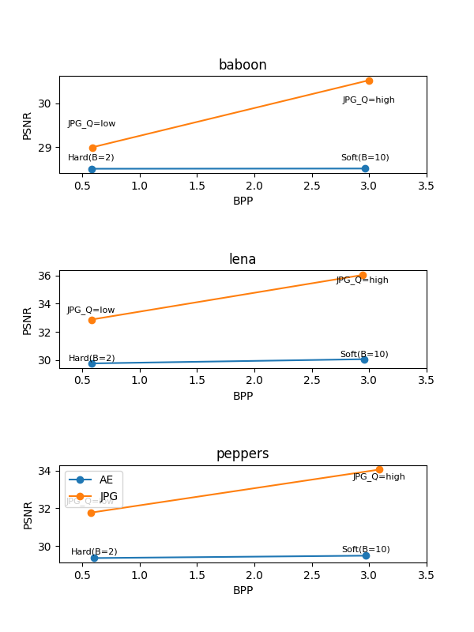

# AutoCompressor

*@author Бобров Олег Борисович, группа М4150*

This repository contains source code for neural compressor. Model was build using **autoencoder** architecture. 
For encoder part pretrained ResNet18 was used. Decoder is mirrored representation of encoder with upsampling layers. 

Latent vector obtained after encoding part is quantized (hard mode with B = 2 and sof mode with B = 10) 
and then encoded using adaptive arithmetic encoding. Arithmetic encoder takes quantized vector with values in range [0; 2^B] as the input and outputs binary sequence.
Encoding is performed using [arithmetic-compressor](https://github.com/kodejuice/arithmetic-compressor) python package. **SimpleAdaptiveModel** was used for probabilities update. 
This model gradually forgets old statistics with exponential moving average.
Embedding size is *1 x 32768* which is only *0.125* of the initial amount of pixels *(512 x 512)*. Smaller embeddings led to worse results (visually). Bigger ones might strongly increase final encoding size.
Qunatization during inference is performed with this formula: 

The problem is that this quantization is not differentiable, so we cannot use it during training. Thus, during training phase 
we add some noise which commensurate in amplitude with or quantization:

)

Below you can find charts of PSNR/BPP comparison between JPG (low and high quality), AE(B=2) and AE(B=10) algorithms on three [test images](resources/test_images).

As we can see, with almost identical BPP (for low quality and high quality images) JPG slightly outperforms encoding with the neural network.
Better quality might be obtained using more complex model or with more training epochs.

Below you can see usage example for coding and decoding. 3 test images were encoded with these commands. 
You can run them all using [test_all.sh](test_all.sh)

## Training

Autoencoders were trained using [130k Images (512x512) - Universal Image Embeddings](https://www.kaggle.com/datasets/rhtsingh/130k-images-512x512-universal-image-embeddings)
dataset. MSE loss was used in both cases. You can find training notebook [here](notebooks/autocompressor_train.ipynb).

## Weights

You can download trained weights from [Google Drive](https://drive.google.com/drive/u/0/folders/1HjcGjdWEY1un_hlVvmX5hlzkH-_v8PMH)

## Encoding

### Soft (B = 10)
`python3 encode.py --input_path=resources/test_images/peppers.png --output_path=resources/encoded/B=10/peppers.encoded --encoder_path=models/model_B=10/encoder.model --quantize_mode=soft`

`python3 encode.py --input_path=resources/test_images/lena.png --output_path=resources/encoded/B=10/lena.encoded --encoder_path=models/model_B=10/encoder.model --quantize_mode=soft`

`python3 encode.py --input_path=resources/test_images/baboon.png --output_path=resources/encoded/B=10/baboon.encoded --encoder_path=models/model_B=10/encoder.model  --quantize_mode=soft`

### Hard (B = 2)

`python3 encode.py --input_path=resources/test_images/peppers.png --output_path=resources/encoded/B=2/peppers.encoded --encoder_path=models/model_B=2/encoder.model --quantize_mode=hard`

`python3 encode.py --input_path=resources/test_images/lena.png --output_path=resources/encoded/B=2/lena.encoded --encoder_path=models/model_B=2/encoder.model --quantize_mode=hard`

`python3 encode.py --input_path=resources/test_images/baboon.png --output_path=resources/encoded/B=2/baboon.encoded --encoder_path=models/model_B=2/encoder.model  --quantize_mode=hard`

## Decoding

### Soft (B = 10)
`python3 decode.py --output_path=resources/results/B=8/peppers_reconstructed.png --input_path=resources/encoded/B=10/peppers.encoded --decoder_path=models/model_B=10/decoder.model --quantize_mode=soft`

`python3 decode.py --output_path=resources/results/B=8/lena_reconstructed.png --input_path=resources/encoded/B=10/lena.encoded --decoder_path=models/model_B=10/decoder.model --quantize_mode=soft`

`python3 decode.py --output_path=resources/results/B=8/baboon_reconstructed.png --input_path=resources/encoded/B=10/baboon.encoded --decoder_path=models/model_B=10/decoder.model --quantize_mode=soft`

### Hard (B = 2)
`python3 decode.py --output_path=resources/results/B=2/peppers_reconstructed.png --input_path=resources/encoded/B=2/peppers.encoded --decoder_path=models/model_B=2/decoder.model --quantize_mode=hard`

`python3 decode.py --output_path=resources/results/B=2/lena_reconstructed.png --input_path=resources/encoded/B=2/lena.encoded --decoder_path=models/model_B=2/decoder.model --quantize_mode=hard`

`python3 decode.py --output_path=resources/results/B=2/baboon_reconstructed.png --input_path=resources/encoded/B=2/baboon.encoded --decoder_path=models/model_B=2/decoder.model --quantize_mode=hard`