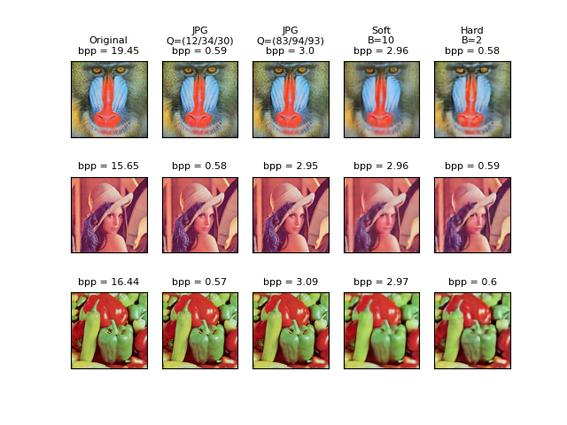
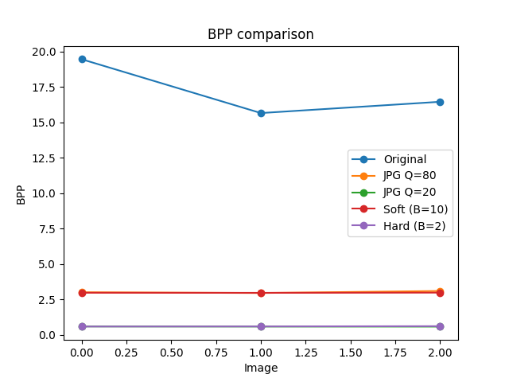

# AutoCompressor

This repository contains source code for neural compressor. Model was build using **autoencoder** architecture. 
For encoder part pretrained ResNet18 was used. Decoder is mirrored representation of encoder with upsampling layers. 

Latent vector obtained after encoding part is quantized (hard mode with B = 2 and sof mode with B = 10) 
and then encoded using adaptive arithmetic encoding.

Below you can find charts of BPP and PSNR comparison between JPG, AE(B=2) and AE(B=10) algorithms on three [test images](resources/test_images).

As we can see, PSNR is similar on both soft and hard encoding. Both models perform worse than JPG in terms of PSNR.
Nevertheless, AE(B=2) has much lower BPP which can be used for storage efficiency in some cases.

Below you can see usage example for coding and decoding. 3 test images were encoded with these commands. 
You can run them all using [test_all.sh](test_all.sh)

## Training

Autoencoders were trained using [130k Images (512x512) - Universal Image Embeddings](https://www.kaggle.com/datasets/rhtsingh/130k-images-512x512-universal-image-embeddings)
dataset. MSE loss was used in both cases. You can find training notebook [here](notebooks/autocompressor_train.ipynb).

## Encoding

### Soft (B = 10)
`python3 encode.py --input_path=resources/test_images/peppers.png --output_path=resources/encoded/B=10/peppers.encoded --encoder_path=models/model_B=10/encoder.model --quantize_mode=soft`

`python3 encode.py --input_path=resources/test_images/lena.png --output_path=resources/encoded/B=10/lena.encoded --encoder_path=models/model_B=10/encoder.model --quantize_mode=soft`

`python3 encode.py --input_path=resources/test_images/baboon.png --output_path=resources/encoded/B=10/baboon.encoded --encoder_path=models/model_B=10/encoder.model  --quantize_mode=soft`

### Hard (B = 2)

`python3 encode.py --input_path=resources/test_images/peppers.png --output_path=resources/encoded/B=2/peppers.encoded --encoder_path=models/model_B=2/encoder.model --quantize_mode=hard`

`python3 encode.py --input_path=resources/test_images/lena.png --output_path=resources/encoded/B=2/lena.encoded --encoder_path=models/model_B=2/encoder.model --quantize_mode=hard`

`python3 encode.py --input_path=resources/test_images/baboon.png --output_path=resources/encoded/B=2/baboon.encoded --encoder_path=models/model_B=2/encoder.model  --quantize_mode=hard`

## Decoding

### Soft (B = 10)
`python3 decode.py --output_path=resources/results/B=8/peppers_reconstructed.png --input_path=resources/encoded/B=10/peppers.encoded --decoder_path=models/model_B=10/decoder.model --quantize_mode=soft`

`python3 decode.py --output_path=resources/results/B=8/lena_reconstructed.png --input_path=resources/encoded/B=10/lena.encoded --decoder_path=models/model_B=10/decoder.model --quantize_mode=soft`

`python3 decode.py --output_path=resources/results/B=8/baboon_reconstructed.png --input_path=resources/encoded/B=10/baboon.encoded --decoder_path=models/model_B=10/decoder.model --quantize_mode=soft`

### Hard (B = 2)
`python3 decode.py --output_path=resources/results/B=2/peppers_reconstructed.png --input_path=resources/encoded/B=2/peppers.encoded --decoder_path=models/model_B=2/decoder.model --quantize_mode=hard`

`python3 decode.py --output_path=resources/results/B=2/lena_reconstructed.png --input_path=resources/encoded/B=2/lena.encoded --decoder_path=models/model_B=2/decoder.model --quantize_mode=hard`

`python3 decode.py --output_path=resources/results/B=2/baboon_reconstructed.png --input_path=resources/encoded/B=2/baboon.encoded --decoder_path=models/model_B=2/decoder.model --quantize_mode=hard`